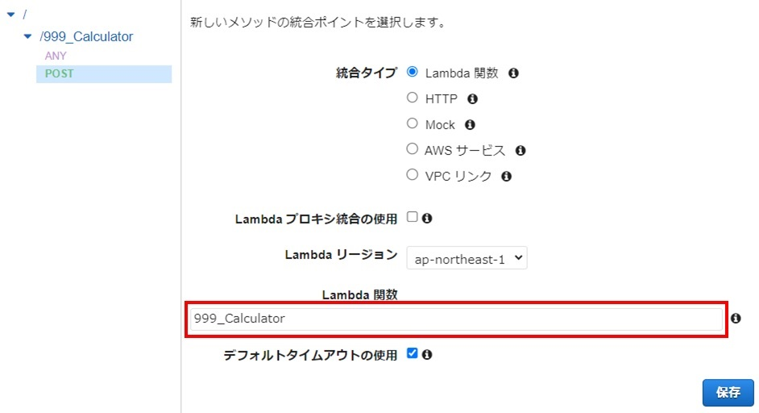

# AWS Lambdaによるサーバレス構築

## 1. AWS Lambda

### 1.1. jarファイルの生成

AWS Lambda（以下、Lambda）にアップロードするAPIをJavaで作成する。ここでは、リクエストで商品名、単価、数量を渡すと、レスポンスで税抜価格と税込価格を返すAPIを作成する。

**pom.xml**

```xml
<dependencies>
  <dependency>
    <groupId>com.amazonaws</groupId>
    <artifactId>aws-lambda-java-core</artifactId>
    <version>1.2.0</version>
  </dependency>
</dependencies>
```

**com.lambda.dto.Response.java**

```java
package com.lambda.dto;

public class Response {
  // リクエスト
  private Map<String, String> request;

  // 税抜価格
  private int taxExcluded;

  // 税込価格
  private int taxIncluded;

  // 各フィールドのgetter/setter
}
```

**com.lambda.api.Calculator.java**

```java
package com.lambda;

import com.amazonaws.services.lambda.runtime.Context;
import com.amazonaws.services.lambda.runtime.RequestHandler;
import com.lambda.dto.Request;
import com.lambda.dto.Response;

public class Calculator implements RequestHandler<Map<String, String>, Response> {
  @Override
  public Response handleRequest(Map<String, String> request, Context context) {
    // リクエストデータを取り出す
    int price = Integer.parseInt(request.get("price"));
    int quantity = Integer.parseInt(request.get("quantity"));

    // リクエスト情報を基に税抜価格と税込価格を算出する
    int taxExcluded = price * quantity;
    int taxIncluded = (int)(price * quantity * 1.1);

    // レスポンスデータを用意し、返却する
    Response response = new Response();
    response.setRequest(request);
    response.setTaxExcluded(taxExcluded);
    response.setTaxIncluded(taxIncluded);
    return response;
  }
}
```

<br>

ビルドツール（Mavenなど）でjarファイルを生成する。

<br>

### 1.2. Lambda関数の生成

AWS Lambdaを用いてAPIを作成する。Lambdaの画面で[関数の作成]ボタンをクリックする。


[一から作成]を選択、関数名やランタイムなどを設定し、[関数の作成]ボタンをクリックする。


関数の概要下にあるコードタブのアップロード元から[.zip または .jarファイル]を選択する。


[アップロード]ボタンをクリックし、jarファイルを選択し、[保存]ボタンをクリックする。


コードタブ > ランタイム設定の[編集]ボタンをクリックする。ランタイム設定画面のハンドラにあるパッケージ名とクラス名の部分を作成したAPIのものに修正し、[保存]ボタンをクリックする。


テストタブ > イベントJSON欄にリクエストで送るデータ（商品名、単価、数量）をJSON形式で記述し、[テスト]ボタンをクリックする。


実行結果としてレスポンス（税抜価格、税込価格）の内容が表示されることを確認する。


<br><br>

## 2. Amazon API Gateway

Amazon API Gateway（以下、API Gateway）をLambda関数のトリガーとして連携することで、Lambda関数をWeb API（REST API）として使用することができる。<br>Lambda関数の概要内の[トリガーを追加]ボタンをクリックする。


トリガーの設定で[API Gateway] > [REST API]を選択し、SecurityやAPI nameを設定し、[追加]ボタンをクリックする。


設定タブのAPI名リンクをクリックし、API Gatewayの詳細に遷移する。


アクションから[メソッドの作成]を選択する。


[POST]を選択し、決定ボタン（✓）をクリックする。


Lambda関数欄に実行対象の関数名を指定し、[保存]ボタンをクリックする。Lambda関数への権限追加に関するメッセージが表示されたら[OK]ボタンをクリックする。



アクションから[APIのデプロイ]を選択する。


ステージと説明を指定し、[デプロイ]ボタンをクリックする。


<br><br>

## 3. 通信確認

curlコマンドやRESTクライアントツールで、API Gatewayのエンドポイントに対してリクエストを送り、レスポンスが返ってくることを確認する。

Windowsでは、次のcurlコマンドで通信確認ができる。

```
> curl -X POST [API Gatewayのエンドポイント] -H "Content-Type: application/json" -d {\"itemName\":\"Apple\",\"price\":100,\"quantity\":5}
{"request":{"itemName":"Apple","price":100,"quantity":5},"taxExcluded":500,"taxIncluded":550}
```

API Gatewayのエンドポイントは、Lambda関数のトリガータブで確認ができる。


<br><br>

## 4. WebアプリからAPIを使用する

API Gatewayで公開したLambda関数に対して、Webアプリから非同期通信でリクエストを送信する。

### 4.1. CORSの有効化

Webアプリ（外部サイト）からAPIを使用するためには、まずCORSを有効化する必要がある。

> CORS（Cross-Origin Resource Sharing）とは、あるオリジンで動いているWebアプリに対して、異なるオリジンとの通信を可能にするセキュリティ上の仕組みである。

<br>

API Gatewayで、対象のリソースを選択し、アクションから[CORS の有効化]を選択する。


[CORSを有効にして既存のCORSヘッダーを置換]ボタンをクリックし、表示される確認画面でも[はい、既存の値を置き換えます]ボタンをクリックする。


CORSヘッダーの置き換えがされ、OPTIONSメソッドが追加されたことを確認したら、**再度APIのデプロイをする。**

<br>

### 4.2. Webアプリからのリクエスト送信

HTMLの画面からAPIに対してデータを送って動作を確認する。データの送信には、JavaScriptの非同期通信（Axios）を使用する。

**index.html**

```html
<!DOCTYPE html>
<html lang="ja">
<head>
  <meta charset="UTF-8">
  <title>Lambda Calculation</title>
  <link rel="stylesheet" href="https://stackpath.bootstrapcdn.com/bootstrap/4.3.1/css/bootstrap.min.css">
  <script src="https://code.jquery.com/jquery-3.3.1.slim.min.js"></script>
  <script src="https://cdnjs.cloudflare.com/ajax/libs/popper.js/1.14.7/umd/popper.min.js"></script>
  <script src="https://stackpath.bootstrapcdn.com/bootstrap/4.3.1/js/bootstrap.min.js"></script>
  <script src="https://cdn.jsdelivr.net/npm/axios/dist/axios.min.js"></script>
  <script type="text/javascript">
  async function calc() {
    // リクエストデータ（JSON）
    const params = JSON.stringify({
      itemName: $('#itemName').val(),
      price: $('#price').val(),
      quantity: $('#quantity').val()
    });

    // 非同期通信
    await axios.post("API Gatewayのエンドポイント", params)
      // 成功時の処理
      .then((response) => {
        // レスポンスデータをコンソールに表示する
        console.log(response.data);
      })
      // エラー時の処理
      .catch((err) => {
        alert('計算時にエラーが発生しました。');
        console.log("err:", err);
      });
  }
  </script>
</head>
<body>
  <div class="container mt-3">
    <div class="row">
      <header class="col-10">
        <h2>Lambda Calculation</h2>
      </header>
    </div>
    <div class="row">
      <article class="col-10">
        <div class="form-group">
          <label for="itemName">商品名：</label>
          <input type="text" class="form-control" id="itemName" name="itemName" required>
        </div>
        <div class="form-group">
          <label for="price">単価：</label>
          <input type="number" class="form-control text-right w-50" id="price" name="price" min="0" max="1000000" value="0" required>
        </div>
        <div class="form-group">
          <label for="quantity">数量：</label>
          <input type="number" class="form-control text-right w-50" id="quantity" name="quantity" min="0" max="100" value="0" required>
        </div>
        <button type="button" class="btn btn-primary" onclick="calc()">送信</button>
      </article>
    </div>
  </div>
</body>
</html>
```

<br>

ローカルでindex.htmlを開き、各値を入力し、[送信]ボタンをクリックする。


ブラウザの開発者ツール > コンソール画面を開き、レスポンスデータ（税抜価格や税込価格）が表示されることを確認する。


<br><br>

## Appendix. GETメソッドにおけるクエリパラメータの送信

GETメソッドにおいてURLクエリパラメータをLambda関数に渡すためには、API Gateway側でクエリパラメータをJSONに置換して送るよう設定する必要がある。

API Gatewayで、対象リソースにGETメソッドを追加する。追加後、[統合リクエスト]リンクをクリックする。


[URLクエリ文字列パラメータ]欄にて、[クエリ文字列の追加]リンクをクリックし、キーとなる名前とマッピング元を下記のように設定する。

| 名前 | マッピング元 |
|------|-------------|
| itemName | 'method.request.querystring.itemName' |
| price | 'method.request.querystring.price' |
| quantity | 'method.request.querystring.quantity' |


<br>

[マッピングテンプレート]欄にて、下記のように設定する。

- リクエスト本文のパススルー
    - テンプレートが定義されていない場合（推奨）
- Context-type
    - application/json
- テンプレート

```
{
  "itemName": "$input.params('itemName')",
  "price": "$input.params('price')",
  "quantity": "$input.params('quantity')"
}
```


<br><br>

次のcurlコマンドで通信確認ができる。

```
> curl -X GET "API Gatewayのエンドポイント?itemName=Apple&price=100&quantity=5"
{"request":{"itemName":"Apple","price":100,"quantity":5},"taxExcluded":500,"taxIncluded":550}
```
