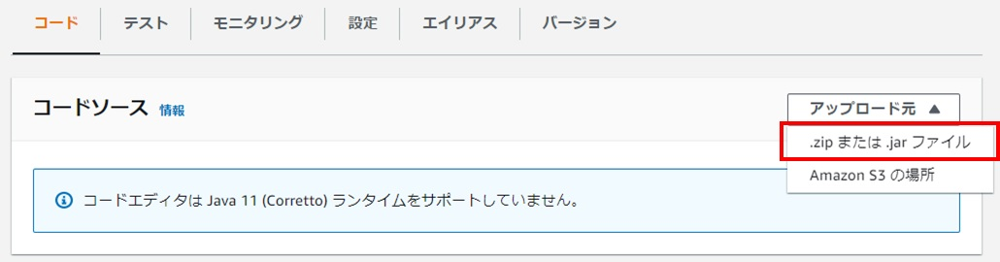

# AWS LambdaによるREST API

### 1. AWS Lambda

#### 1.1. jarファイルの生成

AWS Lambda（以下、Lambda）にアップロードするAPIをJavaで作成する。ここでは、リクエストで商品名、単価、数量を渡すと、レスポンスで税抜価格と税込価格を返すAPIを作成する。

**com.lambda.data.Request.java**

```java
package com.lambda.data;

public class Request {
  // 商品名
  private String itemName;

  // 単価
  private Integer price;

  // 数量
  private Integer quantity;

  // getter/setterは中略
}
```

**com.lambda.data.Response.java**

```java
package com.lambda.data;

public class Response {
  // リクエスト
  private Request request;

  // 税抜価格
  private Integer taxExcluded;

  // 税込価格
  private Integer taxIncluded;

  // getter/setterは中略
}
```

**com.lambda.Calculator.java**

```java
package com.lambda;

import com.amazonaws.services.lambda.runtime.Context;
import com.amazonaws.services.lambda.runtime.RequestHandler;
import com.lambda.data.Request;
import com.lambda.data.Response;

public class Calculator implements RequestHandler<Request, Response> {
  @Override
  public Response handleRequest(Request request, Context context) {
    // リクエスト情報を基に税抜価格と税込価格を算出する
    Integer taxExcluded = request.getPrice() * request.getQuantity();
    Integer taxIncluded = (int)(request.getPrice() * request.getQuantity() * 1.1);

    // レスポンス情報を作成する
    Response response = new Response();
    response.setRequest(request);
    response.setTaxExcluded(taxExcluded);
    response.setTaxIncluded(taxIncluded);

    return response;
  }
}
```

<br>

ビルドツール（Mavenなど）でjarファイルを生成する。

<br>

#### 1.2. Lambda関数の生成

AWS Lambdaを用いてAPIを作成する。Lambdaの画面で[関数の作成]ボタンをクリックする。


[一から作成]を選択、関数名やランタイムなどを設定し、[関数の作成]ボタンをクリックする。


関数の概要下にあるコードタブのアップロード元から[.zip または .jarファイル]を選択する。


